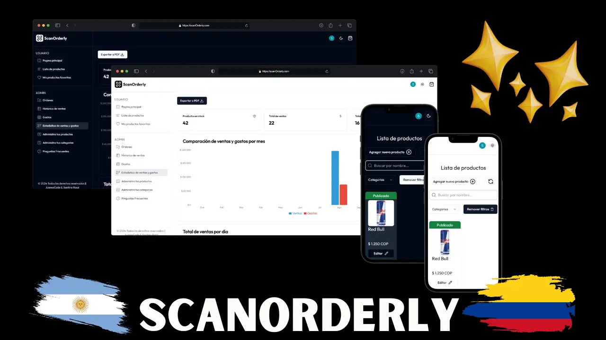
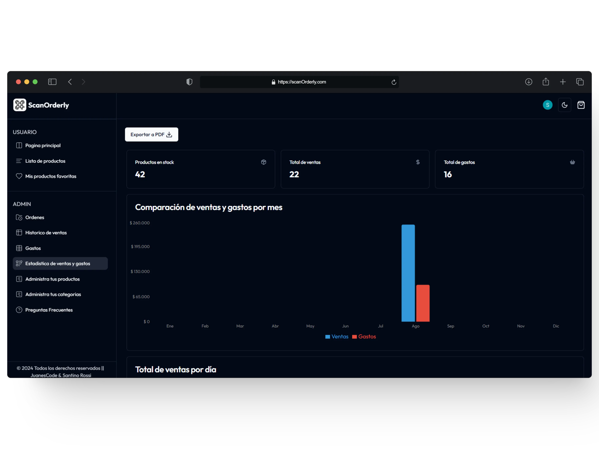
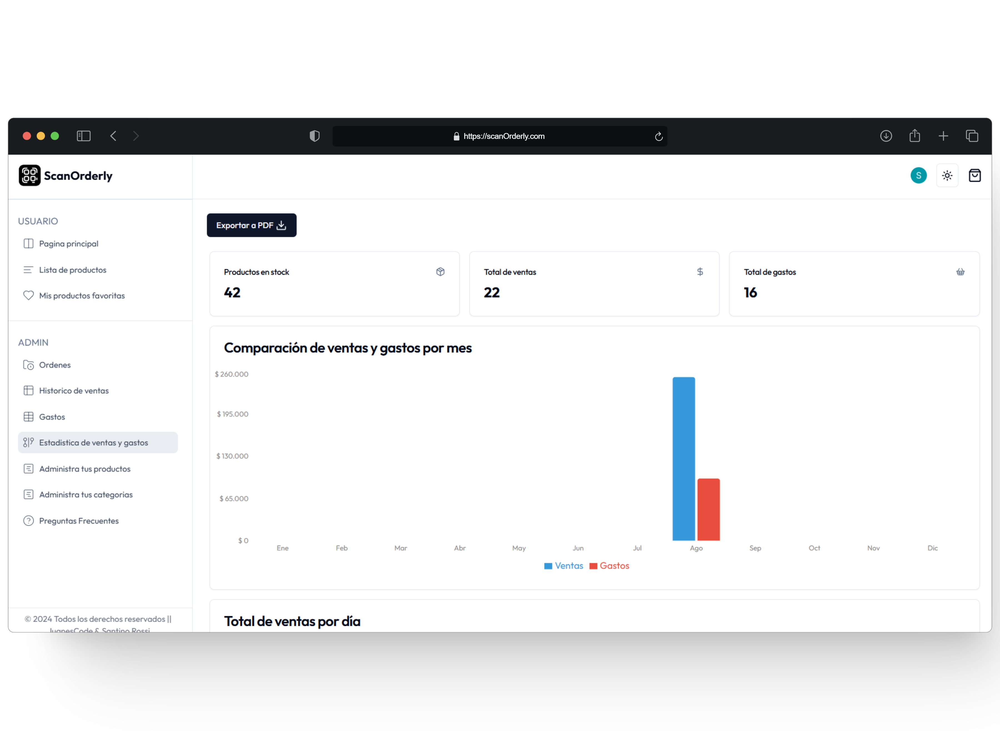
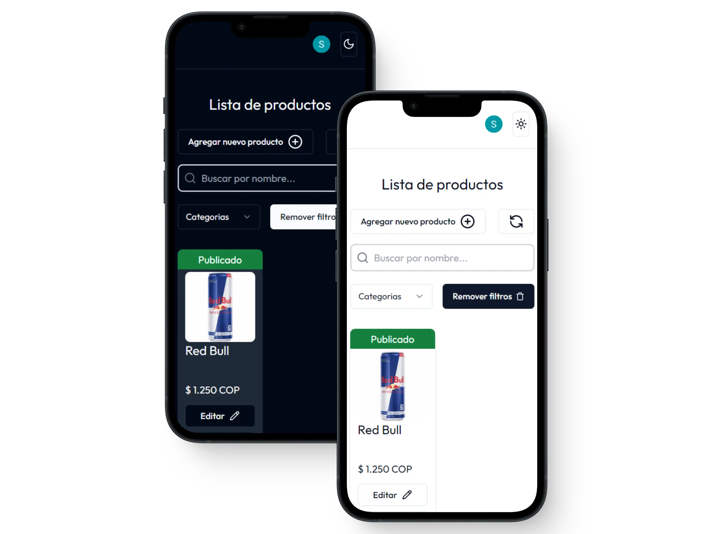

# ScanOrderly

## Overview

ScanOrderly is a simple and efficient software designed for scanning and managing restaurant orders. Our goal is to streamline the ordering process, making it faster and more accurate for both customers and staff.

## Features

- **Easy Scanning**: Quickly scan and process orders with minimal effort.
- **Order Management**: Efficiently manage and track orders in real-time.
- **User-Friendly Interface**: Intuitive design that is easy to navigate.
- **Cross-Platform**: Available on both desktop and mobile devices.

## Creators

### Santino Rossi & Juanes Code

  

    
    
GitHub: <a href="https://github.com/SantinoRossi">SantinoRossi</a>

  

  

    
    
GitHub: <a href="https://github.com/JuanesCode">JuanesCode</a>

  

## Screenshots

### Desktop View

### Mobile View

